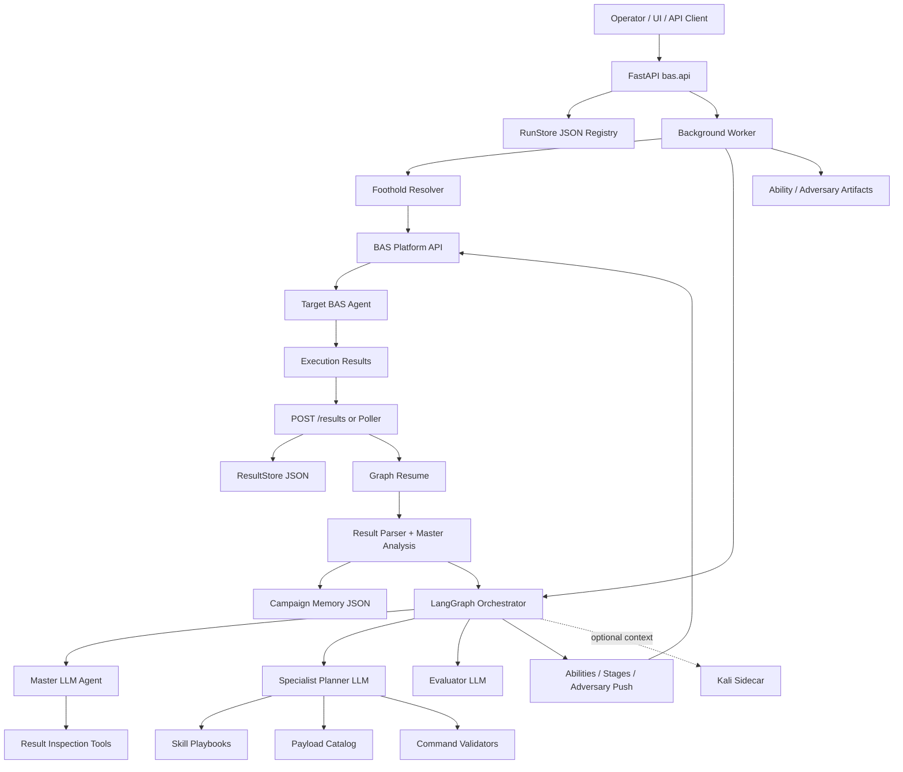
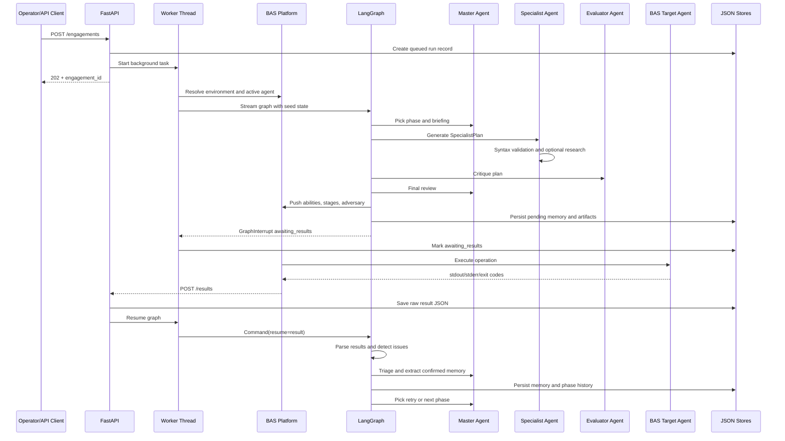
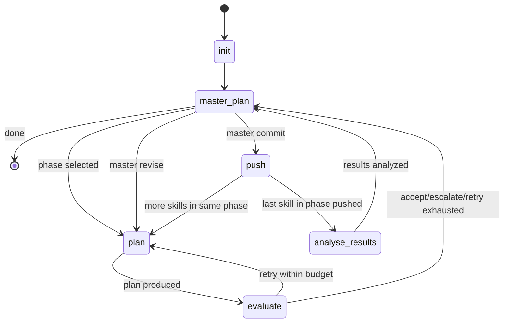
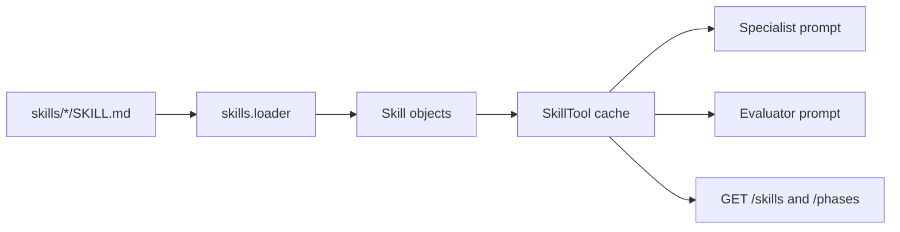
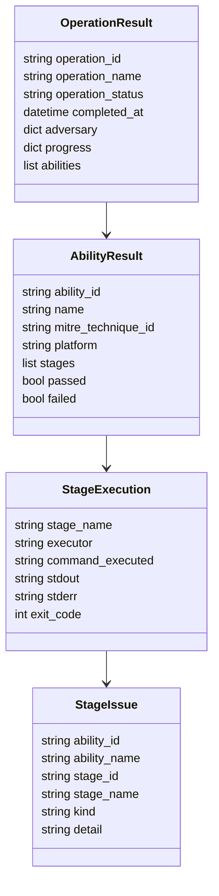
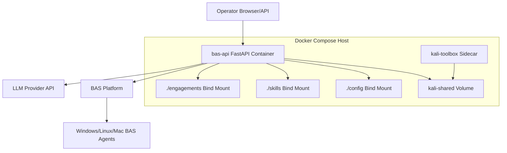
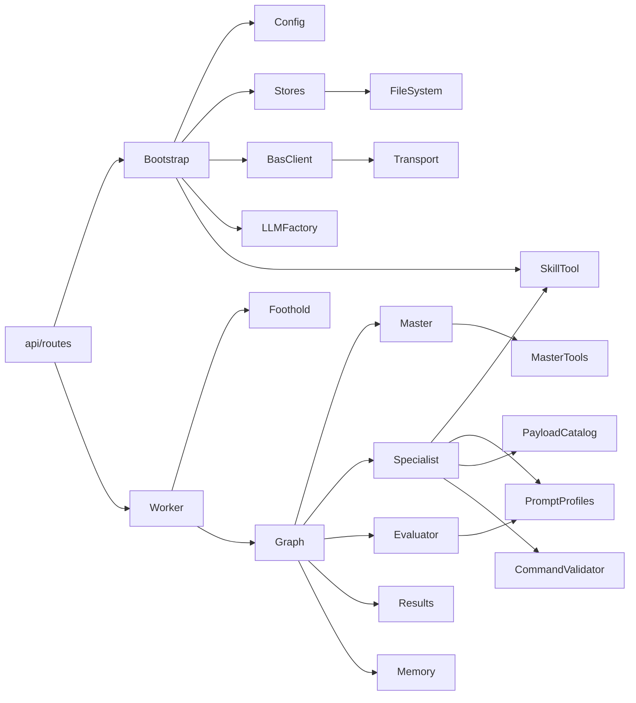

# AI Architecture Knowledge Transfer

Audience: AI Engineers, MLOps Engineers, Backend AI Developers  
Repository: `internal-attack-simulation`  
Primary runtime: Python 3.11, FastAPI, LangGraph, Gemini, file-backed persistence

## Executive Summary

This repository implements an autonomous Breach-and-Attack Simulation (BAS) orchestrator. It does not implement a traditional RAG stack with document chunking, embeddings, and a vector database. Instead, it is an agentic planning and execution system that ingests curated skill playbooks, uses LLM agents to generate BAS abilities and adversaries, pushes those definitions to a BAS backend for target execution, waits for execution results, analyzes outputs, updates campaign memory, and iterates through attack-simulation phases.

The core AI workflow is:

1. Load configuration, skills, payload catalog, BAS client, LLM provider, stores, and LangGraph graph.
2. Receive an engagement request over FastAPI.
3. Resolve a foothold agent from the BAS platform.
4. Use a master LLM agent to select the next kill-chain phase.
5. Use a specialist LLM agent to plan one phase from a skill playbook, memory, payload context, and retry feedback.
6. Use an evaluator LLM agent to critique the plan against phase completion criteria.
7. Use the master agent to review and commit or revise the plan.
8. Push generated abilities, stages, and adversary definitions to the BAS backend.
9. Pause the LangGraph run at `interrupt("awaiting_results")`.
10. Resume from webhook or poller result data.
11. Parse results deterministically, classify issues, and derive phase completion.
12. Use LLM result analysis with selected raw stage output to update confirmed memory.
13. Retry, advance, or finish.

The system is best understood as a checkpointed autonomous agent workflow, not a document QA or vector-search application.

## What Exists And What Does Not

| Capability | Current implementation | Key files | Notes |
|---|---|---|---|
| Document ingestion | Skill playbook ingestion from Markdown files with frontmatter | [src/bas/skills/loader.py](../src/bas/skills/loader.py), [src/bas/tools/skill_tool.py](../src/bas/tools/skill_tool.py), [skills](../skills) | Skills are curated domain instructions, not user documents. |
| Preprocessing | Frontmatter parsing, skill rendering, prompt profile assembly | [src/bas/skills/loader.py](../src/bas/skills/loader.py), [src/bas/agents/prompt_profiles.py](../src/bas/agents/prompt_profiles.py) | No cleaning/token chunk pipeline. |
| Chunking | Not implemented | N/A | Long skills are inserted as rendered prompt context. |
| Embeddings | Not implemented | N/A | No embedding model configured. |
| Vector database | Not implemented | N/A | No FAISS, Chroma, pgvector, Pinecone, Milvus, etc. |
| Retrieval | Deterministic skill lookup, payload catalog lookup, result-file reads | [src/bas/tools/skill_tool.py](../src/bas/tools/skill_tool.py), [src/bas/agents/payload_catalog.py](../src/bas/agents/payload_catalog.py), [src/bas/tools/master_tools.py](../src/bas/tools/master_tools.py) | Retrieval is structured/file-based. |
| Agent orchestration | LangGraph state machine with interrupts and SQLite checkpointing | [src/bas/orchestrator/graph.py](../src/bas/orchestrator/graph.py), [src/bas/bootstrap.py](../src/bas/bootstrap.py) | This is the central AI runtime. |
| Prompt management | Prompt profiles plus skill playbooks plus payload catalog context | [src/bas/agents/prompt_profiles.py](../src/bas/agents/prompt_profiles.py), [skills](../skills), [src/bas/agents/payload_catalog.py](../src/bas/agents/payload_catalog.py) | Prompts are large and phase-specific. |
| Memory system | Deep-merged JSON memory, pending markers, phase history, artifacts | [src/bas/orchestrator/memory.py](../src/bas/orchestrator/memory.py), [src/bas/orchestrator/state.py](../src/bas/orchestrator/state.py) | Memory is file-backed, not vector memory. |
| LLM providers | Provider protocol, Gemini implementation, OpenAI/Anthropic stubs | [src/bas/llm/base.py](../src/bas/llm/base.py), [src/bas/llm/gemini.py](../src/bas/llm/gemini.py) | Gemini is the only operational provider. |
| Evaluation | LLM plan evaluator plus deterministic result issue detector | [src/bas/agents/evaluator.py](../src/bas/agents/evaluator.py), [src/bas/results.py](../src/bas/results.py) | Evaluates plans before push and execution results after run. |
| Report generation | Not a formal report pipeline | [src/bas/orchestrator/memory.py](../src/bas/orchestrator/memory.py), artifacts/results files | Outputs are audit artifacts and memory snapshots. |
| Monitoring | Logs, state log, file artifacts, health endpoint | [src/bas/_logging.py](../src/bas/_logging.py), [src/bas/routes/engagements.py](../src/bas/routes/engagements.py) | No metrics/tracing stack. |
| Deployment | FastAPI service plus optional Kali sidecar via Docker Compose | [Dockerfile](../Dockerfile), [docker-compose.yml](../docker-compose.yml) | Redis/Celery are placeholders only. |

## System Architecture



## End-To-End Request Flow



## LangGraph Control Flow



Critical implementation: [src/bas/orchestrator/graph.py](../src/bas/orchestrator/graph.py).

## Module-Level KT

### API Layer

Files:

- [src/bas/api.py](../src/bas/api.py)
- [src/bas/routes/engagements.py](../src/bas/routes/engagements.py)
- [src/bas/routes/results.py](../src/bas/routes/results.py)
- [src/bas/routes/ui_api.py](../src/bas/routes/ui_api.py)

Purpose:

- Expose HTTP trigger and status surfaces.
- Assemble FastAPI app and route modules.
- Start timeout scanner on application startup.
- Accept BAS execution result webhooks.

Important endpoints:

| Method | Path | Purpose |
|---|---|---|
| `GET` | `/` | Redirect to static dashboard. |
| `GET` | `/healthz` | Liveness and basic config surface. |
| `POST` | `/engagements` | Create an engagement and start background execution. |
| `GET` | `/engagements` | List engagement summaries. |
| `GET` | `/engagements/{engagement_id}` | Inspect status, state, foothold, log tail. |
| `GET` | `/engagements/{engagement_id}/log` | Return full engagement log. |
| `DELETE` | `/engagements/{engagement_id}` | Delete run record. |
| `GET` | `/engagements/{engagement_id}/artifacts` | Return saved ability/adversary specs. |
| `GET` | `/phases` | List known phase to skill mappings. |
| `GET` | `/skills` | List skill metadata. |
| `GET` | `/environments` | Proxy BAS environment list. |
| `POST` | `/results` | Receive execution results from BAS backend. |

Data flow:

1. `POST /engagements` validates `EngagementCreateRequest` from [src/bas/schemas.py](../src/bas/schemas.py).
2. It creates a run record through `RunStore`.
3. It schedules `_run_engagement` in `BackgroundTasks`.
4. Results arrive later through `POST /results`, are persisted idempotently, and resume the graph.

Design decisions:

- Business logic is delegated to `worker.py`, stores, and graph nodes.
- API responses are non-blocking for long LLM/execution flows.
- Result webhooks are idempotent by operation ID.

Bottlenecks and risks:

- No authentication or authorization is visible.
- `MAX_RESULT_PAYLOAD_BYTES` exists but request-size enforcement is not clearly wired.
- FastAPI `BackgroundTasks` are not durable job queues.

Improvement opportunities:

- Add auth, webhook signing, and result size enforcement.
- Move background execution to a queue-backed worker for production.
- Add request correlation IDs and structured logging middleware.

### Worker And Runtime Lifecycle

Files:

- [src/bas/worker.py](../src/bas/worker.py)
- [src/bas/bootstrap.py](../src/bas/bootstrap.py)

Purpose:

- Bootstrap process-global resources.
- Run and resume engagements.
- Resolve foothold target agent.
- Start timeout scanner.
- Persist engagement state transitions.

Key functions:

- `_bootstrap`: creates config, `SkillTool`, stores, BAS client, payload catalog, optional Kali client.
- `_get_compiled_graph`: builds singleton LangGraph with checkpointer.
- `_run_engagement`: resolves foothold, seeds graph, streams until finish or interrupt.
- `_resume_graph`: resumes graph after a result webhook or poller save.
- `_expire_stale_engagements`: hard-timeout recovery for stuck engagements.
- `_kali_sidecar_context`: exposes sidecar status to planner context.

Design decisions:

- Singleton graph and provider avoid repeated heavyweight initialization.
- SQLite checkpointer is default to survive process restart.
- Per-engagement lock prevents concurrent timeout/webhook resume races.

Bottlenecks:

- Threaded background work inside API process limits horizontal scaling.
- Timeout scanner polls file-backed run records.
- LLM and BAS calls happen in worker flow without separate backpressure.

Improvement opportunities:

- Move execution/resume to durable queue workers.
- Add distributed locks if multiple API replicas are introduced.
- Store active graph/resume metadata in a database rather than JSON files.

### Orchestrator State And Graph

Files:

- [src/bas/orchestrator/graph.py](../src/bas/orchestrator/graph.py)
- [src/bas/orchestrator/state.py](../src/bas/orchestrator/state.py)
- [src/bas/orchestrator/memory.py](../src/bas/orchestrator/memory.py)

Purpose:

- Own end-to-end AI workflow.
- Maintain session state across LangGraph nodes.
- Persist memory snapshots and phase history.

Core state fields:

| Field | Purpose |
|---|---|
| `run_id` | Engagement ID and graph thread ID. |
| `foothold` | Selected BAS agent and environment metadata. |
| `kali_sidecar` | Optional sidecar availability/capabilities. |
| `memory` | Confirmed memory plus pending markers. |
| `phase_history` | Structured record of phase plans and execution outcomes. |
| `proposal_log` | Full plan summaries for audit. |
| `current_plan` | Current `SpecialistPlan` JSON. |
| `phase_asset_map` | Ability/stage IDs and name mappings for result analysis. |
| `pending_operation_id` | Operation ID when known. |
| `retry_feedback` | Structured retry guidance from result issues. |
| `issues_to_fix` | Flattened retry text for backward-compatible prompts. |
| `execution_summary` | Structural summary of last operation. |

Important graph nodes:

- `_init_node`: restores memory and defaults state.
- `_master_pick_phase`: chooses phase via master LLM.
- `_make_plan_node`: calls specialist planner.
- `_make_evaluate_node`: calls evaluator.
- `_master_review`: final plan review.
- `_make_push_node`: pushes definitions to BAS and writes pending memory.
- `_make_analyse_results_node`: parses result, updates confirmed memory, retries or advances.

Design decisions:

- Push-time memory is pending-only; confirmed facts are written after result analysis.
- Phase completion requires all abilities to pass and no detected issues.
- Retry feedback is structured and also flattened for prompt compatibility.

Scalability concerns:

- Full graph state can grow with proposal logs, phase history, summaries, and memory.
- Memory projection caps narratives but not every possible structured key.
- Long prompt profiles can increase token cost.

Improvement opportunities:

- Move phase completion policy entirely to [src/bas/results.py](../src/bas/results.py) and remove duplicate local logic.
- Add phase-specific memory validators.
- Add typed `retry_feedback` Pydantic model instead of plain dicts.

### Agent Layer

Files:

- [src/bas/agents/master.py](../src/bas/agents/master.py)
- [src/bas/agents/specialist.py](../src/bas/agents/specialist.py)
- [src/bas/agents/evaluator.py](../src/bas/agents/evaluator.py)
- [src/bas/agents/prompt_profiles.py](../src/bas/agents/prompt_profiles.py)
- [src/bas/agents/payload_catalog.py](../src/bas/agents/payload_catalog.py)

Roles:

| Agent | Responsibility | Inputs | Outputs |
|---|---|---|---|
| Master | Campaign director | memory, phase history, available phases, execution summary | `PhaseBriefing`, `MasterDecision`, `MemoryUpdate` |
| Specialist | Phase planner | skill playbook, foothold, memory, payload catalog, retry feedback | `SpecialistPlan` |
| Evaluator | Plan QA gate | plan summary, skill, memory, completion criteria | `EvaluatorVerdict` |

Prompt management:

- Base prompt and phase-specific completion criteria live in [src/bas/agents/prompt_profiles.py](../src/bas/agents/prompt_profiles.py).
- Curated playbooks live in [skills](../skills).
- Payload context is fetched from BAS and rendered by `PayloadCatalog`.
- Retry context includes `issues_to_fix` and structured `retry_feedback`.

Design decisions:

- Specialist uses separate grounded research before structured generation because Gemini tools cannot be combined with schema output.
- Evaluator is LLM-based because plan quality is semantic and phase-specific.
- Result analysis is two-stage: triage ability names, then inspect selected raw stage outputs.

Bottlenecks:

- Many LLM calls per phase: master pick, specialist generation, research, evaluator, master review, result triage, result extraction.
- Prompt size is large due to phase criteria and skill text.

Improvement opportunities:

- Cache research by `(phase, platform, issue fingerprint)`.
- Add deterministic pre-evaluator validators for known phase contracts.
- Turn selected result extraction into deterministic parsers for common facts, with LLM fallback only for ambiguous outputs.

### Skill Ingestion And Prompt Retrieval

Files:

- [src/bas/skills/loader.py](../src/bas/skills/loader.py)
- [src/bas/tools/skill_tool.py](../src/bas/tools/skill_tool.py)
- [skills](../skills)

Purpose:

- Load `SKILL.md` files and frontmatter.
- Render skill content into planner/evaluator prompts.
- Expose skill summaries and phase mappings.

Ingestion flow:



Preprocessing:

- Parse frontmatter.
- Preserve Markdown body.
- Render playbook text for prompts.

No chunking/embedding/vector search exists. Skill retrieval is exact by skill name or phase mapping.

Improvement opportunities:

- Add schema validation for required frontmatter fields.
- Add prompt-size budgets or summarization for long reference files.
- Add skill tests that assert critical playbooks mention required retry and evidence rules.

### LLM Integration

Files:

- [src/bas/llm/base.py](../src/bas/llm/base.py)
- [src/bas/llm/factory.py](../src/bas/llm/factory.py)
- [src/bas/llm/gemini.py](../src/bas/llm/gemini.py)
- [src/bas/llm/openai.py](../src/bas/llm/openai.py)
- [src/bas/llm/anthropic.py](../src/bas/llm/anthropic.py)

Provider contract:

- `chat`
- `generate_structured`
- `research`
- `classify_grounding_depth`
- `validate_commands`
- `grounded_calls_made`

Gemini implementation:

- Supports structured output with schema sanitization.
- Supports Google Search grounding for research.
- Uses retry logic for transient provider failures.
- Enforces grounded-call budget.
- Supports code-execution command validation where available.

Known limitation:

- OpenAI and Anthropic are stubs. The architecture is provider-oriented, but production runtime is Gemini-only unless those adapters are completed.

### Command Validation

Files:

- [src/bas/tools/command_validator.py](../src/bas/tools/command_validator.py)
- [src/bas/agents/specialist.py](../src/bas/agents/specialist.py)

Purpose:

- Catch syntax issues before pushing commands to BAS.
- Validate PowerShell with parser API when available.
- Validate bash/sh with `bash -n` or `sh -n`.
- Heuristically validate cmd.
- Warn on unresolved placeholders.

Data flow:

1. Specialist emits a plan.
2. `validate_plan` runs shell-native validation.
3. If syntax errors exist, the specialist asks the LLM to regenerate commands once.
4. On retry flows, provider `validate_commands` can add semantic command validation.
5. Push-time validation checks payload current-directory usage.

Improvement opportunities:

- Make all unresolved placeholders hard failures.
- Add semantic linting for PowerShell 5.1 unsupported parameters, native executable quoting, and known-bad retry fingerprints.

### BAS Client Layer

Files:

- [src/bas/client/facade.py](../src/bas/client/facade.py)
- [src/bas/client/transport.py](../src/bas/client/transport.py)
- [src/bas/client/abilities.py](../src/bas/client/abilities.py)
- [src/bas/client/adversaries.py](../src/bas/client/adversaries.py)
- [src/bas/client/agents.py](../src/bas/client/agents.py)
- [src/bas/client/environments.py](../src/bas/client/environments.py)
- [src/bas/client/operations.py](../src/bas/client/operations.py)
- [src/bas/client/payloads.py](../src/bas/client/payloads.py)
- [src/bas/client/feedback.py](../src/bas/client/feedback.py)
- [src/bas/client/kali.py](../src/bas/client/kali.py)

Purpose:

- Encapsulate BAS REST API access.
- Create abilities and stages.
- Create adversaries and link abilities.
- Poll operation details.
- Fetch payload catalog metadata.
- Resolve environment agents.
- Notify backend on completion.
- Optionally talk to Kali sidecar.

Design decisions:

- BAS client has no authentication in M1.
- Resource clients wrap endpoint-specific behavior.
- Dry-run client supports tests and offline execution.

Scalability concerns:

- Operation discovery is partly side-effect based via adversary linkage and polling.
- Multiple simultaneous operations for one adversary can be ambiguous if backend behavior changes.

Improvement opportunities:

- Prefer explicit operation creation/start if backend supports it.
- Store operation IDs immediately after backend creation.
- Add retry/backoff policy and circuit breakers around BAS transport.

### Result Parsing And Memory Update

Files:

- [src/bas/results.py](../src/bas/results.py)
- [src/bas/tools/master_tools.py](../src/bas/tools/master_tools.py)
- [src/bas/orchestrator/memory.py](../src/bas/orchestrator/memory.py)

Result model:



Issue categories include:

- `placeholder_token`
- `tool_not_found`
- `timeout`
- `cross_var_leak`
- `psh_parse_error`
- `error_marker`
- `type_not_found`
- `unsupported_parameter`
- `access_denied`

Phase completion rules:

- Operation must not be failed.
- At least one ability must exist and pass.
- Every ability must pass.
- No detected issues may exist.
- Exit code 0 is not sufficient if stdout/stderr contains failure markers.

Memory write phases:

| Time | Memory behavior |
|---|---|
| Push | Persist pending intent only via `pending.*` markers. |
| Result analysis | Clear pending markers, merge confirmed facts, append narrative, update phase history. |
| Timeout | Clear pending markers and write timeout retry feedback. |

Improvement opportunities:

- Add deterministic extractors for common memory keys.
- Add evidence ledger with source operation, ability, stage, excerpt, and confidence.
- Add per-phase memory validators before marking phase complete.

### Persistence And Storage

Files:

- [src/bas/persistence/runs.py](../src/bas/persistence/runs.py)
- [src/bas/persistence/results.py](../src/bas/persistence/results.py)
- [src/bas/persistence/artifacts.py](../src/bas/persistence/artifacts.py)
- [src/bas/orchestrator/memory.py](../src/bas/orchestrator/memory.py)

Storage layout:

```text
engagements/ or runs/
  <engagement_id>.json                  # RunStore record
  <engagement_id>/
    memory.json                         # campaign memory snapshot
    results/
      <operation_id>.json               # raw backend operation result
    abilities/
      <ability_id>.json                 # pushed ability spec
    adversaries/
      <adversary_id>.json               # pushed adversary spec
runs/checkpoints.db                     # LangGraph SQLite checkpoint DB
```

Database schema:

- There is no application relational schema.
- Durable app state is JSON-on-disk plus LangGraph SQLite checkpoint tables managed by LangGraph.
- The SQLite checkpoint schema is owned by `langgraph-checkpoint-sqlite`, not this repository.

JSON record shapes:

- Run record: `run_id`, `status`, `started_at`, `finished_at`, `request`, `state`, `error`.
- Memory snapshot: `run_id`, `updated_at`, `label`, `campaign_progress`, `memory`.
- Result record: full backend operation result payload.
- Artifact record: ability/adversary spec plus provenance.

Scalability concerns:

- File-backed records are easy to inspect but weak for indexing, retention, analytics, high concurrency, and multi-replica deployment.
- Raw result and memory JSON may contain sensitive output.

Improvement opportunities:

- Move run registry and memory metadata to Postgres.
- Store raw result blobs in object storage with encryption and retention.
- Add redaction/encryption for secrets and host data.

### Configuration And Environment Variables

Files:

- [src/bas/config.py](../src/bas/config.py)
- [config/config.yaml](../config/config.yaml)
- [docker-compose.yml](../docker-compose.yml)

Configuration sections:

| Section | Purpose |
|---|---|
| `bas` | BAS backend base URL, timeout, dry-run flag, environment selector. |
| `llm` | Provider, model, classifier model, API key env var, thinking level, grounding. |
| `run` | Output directory and log level. |
| `execution` | Wait timeout, hard timeout, polling, checkpointing. |
| `kali` | Optional sidecar base URL and timeouts. |

Important env vars:

| Variable | Used by | Purpose |
|---|---|---|
| `BAS_CONFIG` | Config loader | Override config file path. |
| `BAS_BASE_URL` | `config.yaml` | BAS backend URL. |
| `BAS_DRY_RUN` | `config.yaml` | Dry-run mode. |
| `BAS_ENVIRONMENT_ID` | `config.yaml` | Pin environment by UUID. |
| `BAS_ENVIRONMENT_NAME` | `config.yaml` | Pin environment by name. |
| `BAS_ENGAGEMENTS_DIR` | Bootstrap | Override run/artifact root. |
| `BAS_RUNS_DIR` | Bootstrap | Alternate output-dir override. |
| `GEMINI_API_KEY` | LLM factory | Gemini credential. |
| `LLM_THINKING_LEVEL` | `config.yaml` | Gemini thinking level. |
| `LOG_LEVEL` | Logging/config | Runtime log level. |
| `KALI_BASE_URL` | `config.yaml` | Sidecar URL. |
| `KALI_ENABLED` | `config.yaml` | Enable sidecar client. |

Known config issue:

- `result_poll_interval` default is `40`, but its description/comment mentions seven minutes. Align comment and default.

### Deployment Architecture



Deployment files:

- [Dockerfile](../Dockerfile)
- [docker-compose.yml](../docker-compose.yml)
- [docker/kali/Dockerfile](../docker/kali/Dockerfile)
- [docker/kali/api/kali_api/main.py](../docker/kali/api/kali_api/main.py)

Runtime services:

- `bas-api`: FastAPI orchestration service on port `8765`.
- `kali-toolbox`: optional FastAPI sidecar on container port `9000`, host port `9500`.
- Redis/Celery placeholders are commented out and not active.

### Monitoring And Operations

Current observability:

- Python logging under the `bas` logger.
- `/healthz` liveness endpoint.
- Engagement `state["log"]` and `/engagements/{id}/log`.
- `proposal_log` in state.
- Raw result JSON files.
- Ability/adversary artifacts.
- Memory snapshots.

Missing observability:

- No metrics endpoint.
- No distributed tracing.
- No LLM latency/cost tracking beyond provider grounded-call count.
- No per-node LangGraph timing metrics.
- No structured audit event sink.

Recommended metrics:

- Engagements by status.
- Phase retry count.
- LLM calls by agent and provider.
- Grounded calls remaining.
- Plan validation failure count.
- Result webhook latency.
- Poller lag.
- Timeout scanner expirations.
- Phase completion and failure reasons.

## Repository Understanding Guide For New AI Engineers

### Day 1: Build The Mental Model

Read in this order:

1. [README.md](../README.md) for basic setup.
2. [config/config.yaml](../config/config.yaml) and [src/bas/config.py](../src/bas/config.py) for runtime knobs.
3. [src/bas/api.py](../src/bas/api.py) and [src/bas/routes/engagements.py](../src/bas/routes/engagements.py) for API entry points.
4. [src/bas/worker.py](../src/bas/worker.py) for run/resume lifecycle.
5. [src/bas/orchestrator/graph.py](../src/bas/orchestrator/graph.py) for the core agent graph.
6. [src/bas/agents/master.py](../src/bas/agents/master.py), [src/bas/agents/specialist.py](../src/bas/agents/specialist.py), and [src/bas/agents/evaluator.py](../src/bas/agents/evaluator.py) for AI roles.
7. [src/bas/results.py](../src/bas/results.py) for phase completion and failure semantics.
8. [skills](../skills) and [src/bas/agents/prompt_profiles.py](../src/bas/agents/prompt_profiles.py) for prompt/task design.

### Day 2: Run And Debug A Flow

Suggested local commands:

```powershell
uv sync
uv run pytest
uv run uvicorn bas.api:app --host 0.0.0.0 --port 8765 --reload
```

Trigger a dry run if configured:

```powershell
$env:BAS_DRY_RUN="true"
uv run uvicorn bas.api:app --host 0.0.0.0 --port 8765 --reload
```

Inspect after a run:

- Run record: `engagements/<id>.json`
- Memory: `engagements/<id>/memory.json`
- Results: `engagements/<id>/results/*.json`
- Abilities: `engagements/<id>/abilities/*.json`
- Adversaries: `engagements/<id>/adversaries/*.json`

### Critical Execution Paths

Start engagement:

```text
POST /engagements
-> routes/engagements.submit_engagement
-> worker._run_engagement
-> foothold.resolve_foothold
-> bootstrap._get_compiled_graph
-> graph._stream_graph
```

Plan/push/wait:

```text
graph.init
-> master_plan
-> plan
-> evaluate
-> master_plan review
-> push
-> analyse_results interrupt
```

Resume with results:

```text
POST /results
-> routes/results.receive_results
-> ResultStore.save
-> worker._resume_graph
-> graph.analyse_results
-> results.parse_operation_result
-> results.detect_issues
-> master.analyse_results
-> persist_memory
```

### Component Dependency Map



## AI-Specific Business Logic

Key rules embedded in prompts and code:

- Discovery must precede AD enumeration when a domain controller is found.
- AD enumeration must precede privilege escalation or credential access when AD is present.
- Plans must use payload IDs for pre-uploaded payloads and current-directory invocation.
- `pending.*` memory is unconfirmed intent only.
- Confirmed facts are only written after execution result analysis.
- Exit code 0 is not enough for success when output contains failure markers.
- All abilities in a phase must pass and no issues may be detected before a phase is complete.
- Retry planning must use `retry_feedback` and avoid repeating the same failed command form.
- Safety ACKs gate destructive/high-risk techniques.

## Technical Debt And Refactoring Targets

High priority:

1. Add authentication and authorization for API routes, UI skill editing, and result webhooks.
2. Enforce result payload size limits.
3. Implement or remove OpenAI/Anthropic provider claims.
4. Consolidate duplicate phase completion logic.
5. Add database-backed run/memory/artifact metadata.
6. Add deterministic memory extractors and validators per phase.
7. Add typed retry feedback models.
8. Add secret redaction/encryption for raw results and memory.

Medium priority:

1. Add metrics and tracing.
2. Replace FastAPI background tasks with durable queue workers.
3. Clarify or remove legacy router module.
4. Add end-to-end API tests with checkpoint resume.
5. Cache research calls by issue fingerprint.
6. Add prompt-size budgets for large skill playbooks.

Low priority:

1. Improve static/dry-run planner realism.
2. Add richer UI for phase history and retry feedback.
3. Add automatic Mermaid architecture export in CI.

## Security Risks

- No visible API authentication.
- Skill editing can alter planner behavior if exposed without controls.
- Raw results may contain credentials and are persisted as plain JSON.
- LLM prompts can include sensitive operational details.
- BAS backend currently described as no-auth in M1.
- Kali sidecar can execute commands if enabled; access must be network-restricted.
- Webhook results should be signed or otherwise authenticated.

## Performance And Scalability Bottlenecks

- LLM call count per phase is high.
- Prompt profiles are large.
- JSON file storage is not ideal for high concurrency.
- Background threads are not durable distributed workers.
- Result polling can become noisy at scale.
- Memory/proposal logs may grow over long campaigns.
- Skill and prompt rendering is deterministic but not token-budget-aware.

## Recommended Roadmap

### Short Term

- Add auth/webhook signature checks.
- Enforce result payload size.
- Add phase-specific memory validators.
- Make command validator fail unresolved placeholders.
- Add metrics for graph node duration and LLM calls.

### Medium Term

- Move run state to Postgres and raw blobs to encrypted object storage.
- Add deterministic extractors for common result facts.
- Implement OpenAI/Anthropic providers or document Gemini-only support.
- Replace background tasks with queue workers.

### Long Term

- Add multi-tenant RBAC and audit trails.
- Add full traceability from memory facts to raw result excerpts.
- Add prompt evaluation datasets and regression tests.
- Add sidecar tool execution as a first-class graph capability if required.

## Glossary

| Term | Meaning |
|---|---|
| Ability | A BAS executable technique definition with one or more stages. |
| Adversary | A BAS container/grouping of abilities. |
| Engagement | One orchestrated campaign run. |
| Foothold | Selected BAS agent/environment where abilities can execute. |
| Skill | Markdown playbook guiding the planner for a phase. |
| Phase | Canonical kill-chain stage such as discovery, ad-enumeration, privesc, credaccess. |
| Pending memory | Planned but unconfirmed intent, stored as `pending.*`. |
| Confirmed memory | Facts extracted from actual execution output. |
| Retry feedback | Structured issue context from failed execution used for autonomous repair. |
| Payload catalog | BAS-provided metadata for pre-uploaded tools/binaries. |

## Fast Productivity Checklist

- To modify AI planning behavior, start with [src/bas/agents/prompt_profiles.py](../src/bas/agents/prompt_profiles.py) and the relevant [skills](../skills) playbook.
- To modify orchestration, start with [src/bas/orchestrator/graph.py](../src/bas/orchestrator/graph.py).
- To modify success/failure semantics, start with [src/bas/results.py](../src/bas/results.py).
- To modify API behavior, start with [src/bas/routes](../src/bas/routes) and [src/bas/worker.py](../src/bas/worker.py).
- To modify LLM provider behavior, start with [src/bas/llm/base.py](../src/bas/llm/base.py) and [src/bas/llm/gemini.py](../src/bas/llm/gemini.py).
- To debug a run, inspect `memory.json`, raw result JSON, ability artifacts, `state["log"]`, and `proposal_log` in that order.